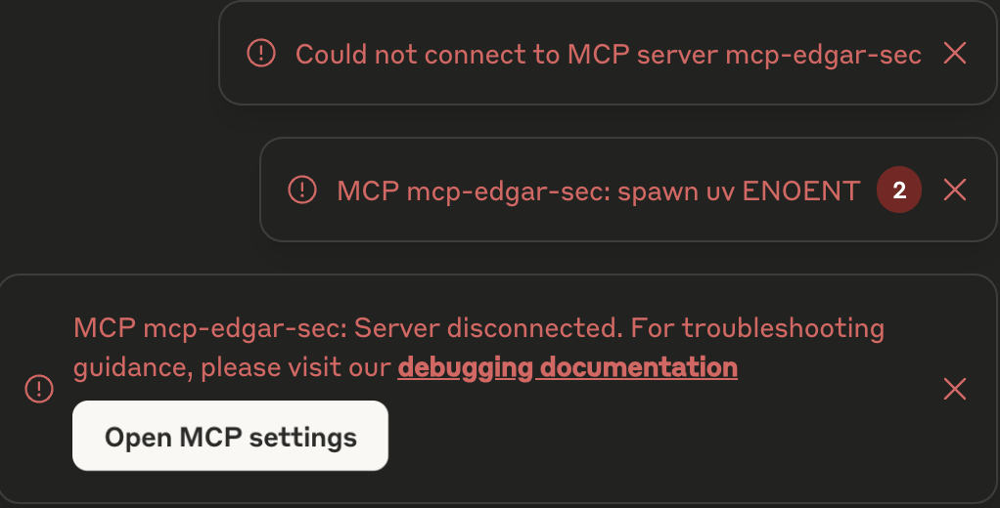
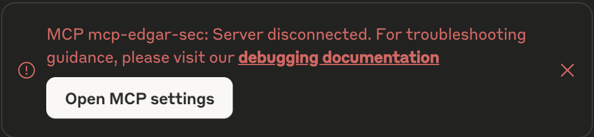

# EDGAR SEC API Client

mcp-edgar-sec implements an MCP (Model Context Protocol) server which allows to connect a MCP client, such as a chat app, with the SEC Edgar API.

## Table of Contents

- [Overview](#overview)
- [Features](#features)
- [Installation](#installation)
- [MCP Server](#mcp-server)
  - [Connecting with Claude Desktop App](#connecting-with-claude-desktop-app)
  - [Troubleshooting](#troubleshooting)
- [EDGAR SEC MCP Server](docs/mcp_server.md#edgar-sec-mcp-server)
  - [Overview](docs/mcp_server.md#overview)
  - [Available Resources](docs/mcp_server.md#available-resources)
  - [Available Tools](docs/mcp_server.md#available-tools)
  - [Available Prompts](docs/mcp_server.md#available-prompt-templates)
  - [Testing the MCP Server](docs/mcp_server.md#testing-the-mcp-server)
- [CLI Interface](docs/cli.md#edgar-sec-cli-mode)
- [Development](#development)
- [License](#license)

## Overview

This repository provides two main execution modes:

1. **MCP Server** (Primary Use Case): A Model Control Protocol server that enables AI systems to interact with SEC EDGAR data through a structured interface.
2. **CLI Tool**: A command-line interface for human users to directly query SEC EDGAR data and test the edgar client.

The repo uses the amazing python package [edgartools](https://github.com/dgunning/edgartools) to connect to the SEC Edgar API. Give it a look for more features which are missing here!

## Features

- Configuration resources for valid CIK/ticker data and SEC form types
- Tools for querying company information (name, tickers, SIC description, filings)
- Financial statement retrieval (balance sheets, income statements, cash flow statements)
- Pagination support for large result sets

## Installation

1. Clone the repository:

```bash
git clone https://github.com/cotrane/mcp-edgar-sec.git
cd mcp-edgar-sec
```

2. Create a virtual environment and install dependencies using `uv`:

```bash
uv venv
source .venv/bin/activate  # On Unix/macOS
# or
.venv\Scripts\activate  # On Windows
uv pip install -e .
```

## MCP Server

The MCP server provides a structured interface for AI systems to interact with SEC EDGAR data.

### Connecting with Claude Desktop App

In order to use the MCP Server together with the Claude Desktop App, you have to:

1. Download the [Claude Desktop App](https://claude.ai/download)
2. Clone the repo

  ```bash
  git clone https://github.com/cotrane/mcp-edgar-sec.git
  ```

3. Add the mcp server configuration to `claude_desktop_config.json`. This can be done by opening `Claude` -> `Settings` -> `Developer` through the menu bar of the Desktop App. Here, you either edit an existing or create a new `claude_desktop_config.json` file and copy the following configuration into the `mcpServer` section.

```json
{
  "mcpServers": {
    "mcp-edgar-sec": {
      "command": "/Path/to/uv/executable",
      "args": [
        "run",
        "--with",
        "mcp",
        "--with",
        "edgartools",
        "--with",
        "pandas",
        "--with",
        "requests",
        "--with",
        "nest_asyncio",
        "--directory",
        "/Path/to/mcp-edgar-sec/repo",
        "mcp",
        "run",
        "src/server.py"
      ]
    }
  }
}
```

4. Restart the Claude Desktop App

This should load the added MCP Server. You can verify it by clicking on the hammer symbol in the chat bar.

<center>
 
</center>


The steps are also given in the [official documentation](https://modelcontextprotocol.io/quickstart/user).

## Troubleshooting

### Error Spawn uv

If you have inserted the MCP Server config into `claude_desktop_config.json` but get the error shown in the screenshot

<center>
 
</center>

when opening the Claude App, you likely need to specify the absolute path to the `uv` executable. On a MAC, it is usually in `~/.local/bin/uv`. This should fix that issue.

### Tools not showing

If you open the Claude App but the tool are not showing up in the prompt bar and you get a

<center>
 
</center>

warning, it might be that the path to the `server.py` file is specified wrong. I got this error when giving the absolute path to the file `args` part of the config. So, instead of specifying the directory separately as shown above, I used

```json
      "args": [
        "run",
        "--with",
        "mcp",
        "--with",
        "edgartools",
        "--with",
        "pandas",
        "--with",
        "requests",
        "--with",
        "nest_asyncio",
        "mcp",
        "run",
        "/Users/username/mcp-edgar-sec/src/server.py"
      ]
```

This did not work for me. Only specifying the directory to the cloned git repo separately got the tools to work.

## Development

### Running Tests

```bash
pytest
```

### Code Style

This project uses:

- `black` for code formatting
- `pylint` for code linting

To format code:

```bash
black .
```

To check code style:

```bash
pylint src tests
```

## License

MIT License
